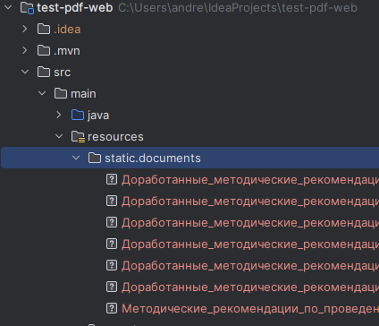
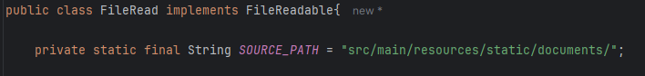
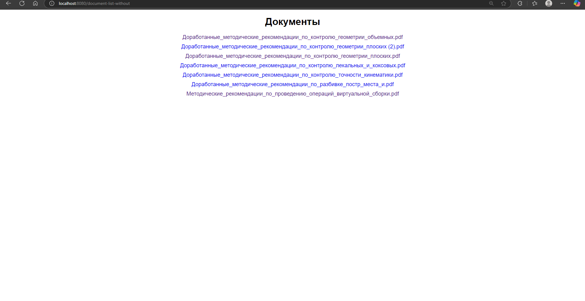
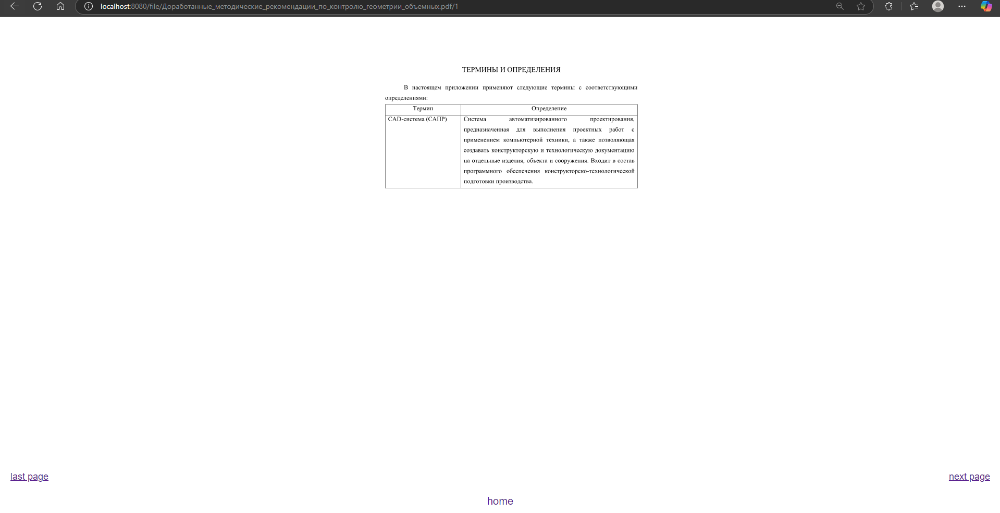
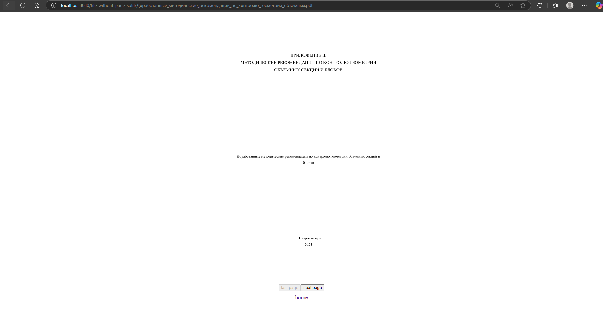

## MVC-приложение для постраничного просмотра pdf-файлов
### Директория расположения документов
Путь директории - src/main/resources/static/documents

Можно задать путь директории в классе FileRead

### GUI
Было реализовано 2 варианта просмотра файла
1) каждая страница файла - отдельная страница html (ручки: /document-list и /file/название_файла/номер_страницы)
2) загрузка всего документа на страницу и переключение с помощью js (ручки: /document-list-without и /file-without-page-split/название_файла)
#### Основное окно

(не зависит от варианта)
#### Окно просмотра для первого варианта

#### Окно просмотра для второго варианта
